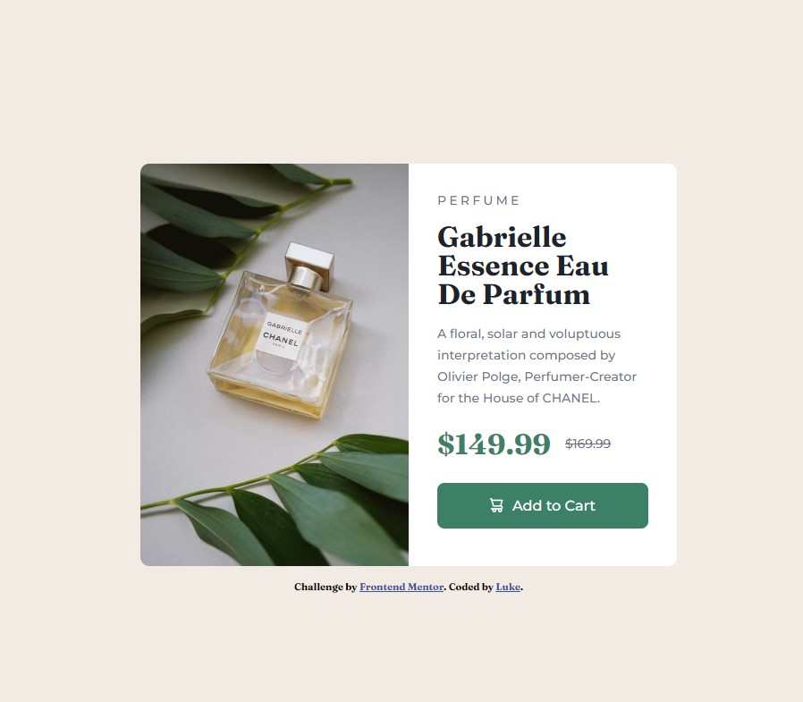

# Frontend Mentor - Product preview card component solution

This is a solution to the [Product preview card component challenge on Frontend Mentor](https://www.frontendmentor.io/challenges/product-preview-card-component-GO7UmttRfa). Frontend Mentor challenges help you improve your coding skills by building realistic projects.

## Table of contents

- [Overview](#overview)
  - [The challenge](#the-challenge)
  - [Screenshot](#screenshot)
  - [Links](#links)
- [My process](#my-process)
  - [Built with](#built-with)
  - [What I learned](#what-i-learned)
  - [Continued development](#continued-development)
- [Author](#author)

## Overview

### The challenge

Users should be able to:

- View the optimal layout depending on their device's screen size
- See hover and focus states for interactive elements

### Screenshot

### Links

- Solution URL: [Github](https://github.com/SkarbekLukasz/frontendmentor-product-preview-card-component-main)
- Live Site URL: [Github Pages](https://your-live-site-url.com)

## My process

### Built with

- Semantic HTML5 markup
- CSS custom properties
- Flexbox
- CSS Grid
- Mobile-first workflow

### What I learned

Used grid system for desktop layout for the first time.

### Continued development

I need to work more on sizing using relative units, also extra work needed with grid system and setting dimensions for specific boxing.

## Author

- Website - [Luke](https://github.com/SkarbekLukasz)
- Frontend Mentor - [@SkarbekLukasz](https://www.frontendmentor.io/profile/SkarbekLukasz)
